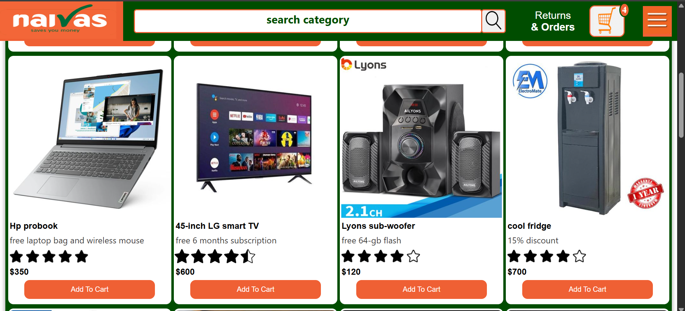
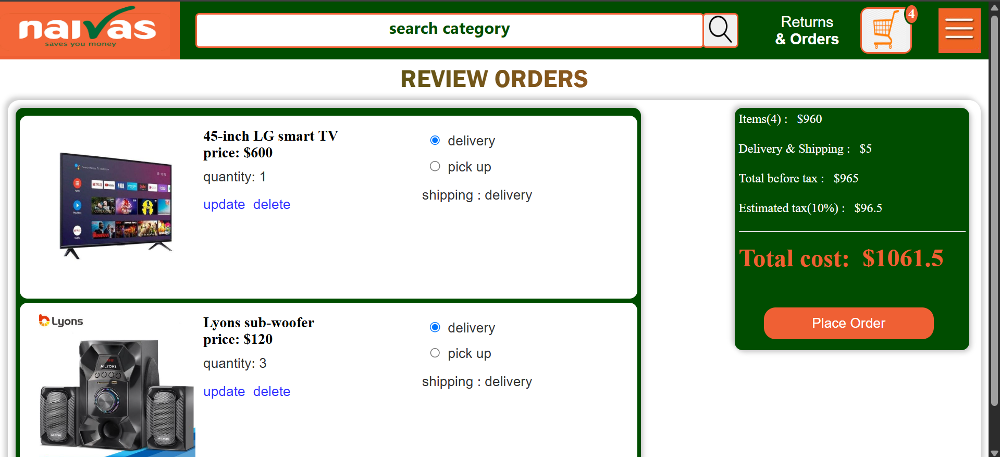
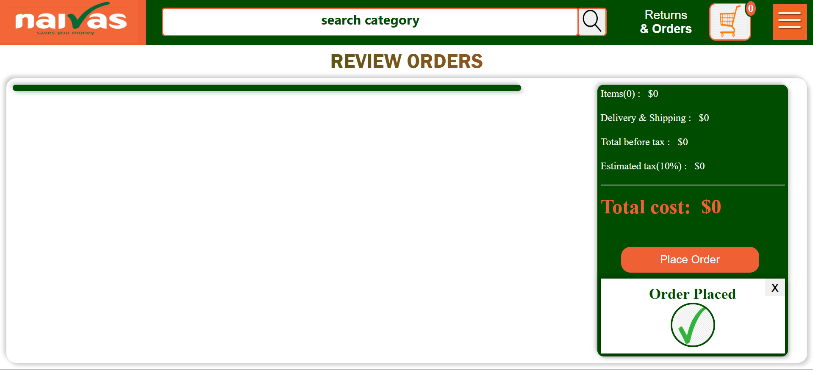
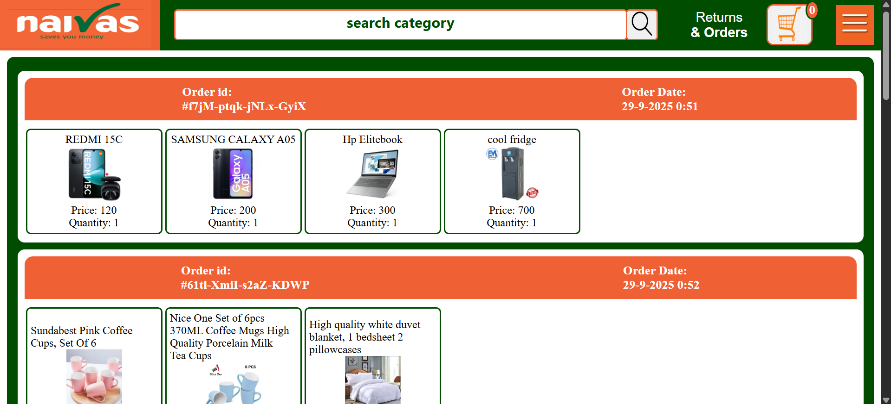
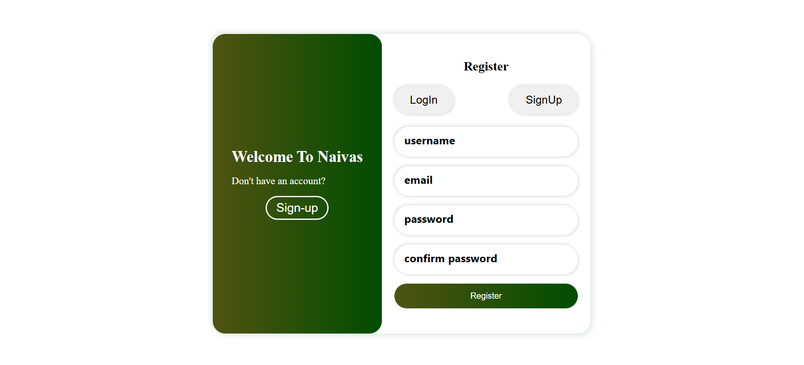

React + Django Naivas E-commerce website

A full-stack e-commerce platform built with **React (frontend)** and **Django REST Framework (backend)**.  
It supports user authentication, product management, shopping cart, and checkout functionality.

## 🖼️ Screenshots









## ✨ Features

- 🔐 User authentication (Login, Register, JWT)
- 🛍️ Browse and filter products
- 🧺 Add to cart and update quantities
- 💳 Checkout and order summary
- 🧾 Admin panel for managing products and orders
- 📦 REST API built with Django REST Framework
- ⚡ React frontend with Redux state management


## 🧰 Tech Stack

**Frontend:** React, Redux, Axios, CSS  
**Backend:** Django, Django REST Framework, mySQL
**Authentication:** JWT (JSON Web Tokens)  
**Deployment:** Vercel (frontend) + Render (backend)

ecommerce/
│
├── server/
  |__naivas
    |
│   ├── manage.py
│   ├── naivas/
│   ├── accounts/
│   └── orders/
│
└── client/
   |__hostel-app/    
     ├── src/
     ├── package.json
     └── public/

## ⚙️ Installation

### 1. Clone the repository
```bash
git clone https://github.com/Ephantus2/ecommerce-react-django.git
cd ecommerce-react-django

### 2. setup Backend

cd server
python -m venv venv
venv\Scripts\Activate.ps1
pip install -r requirements.txt
python manage.py migrate
python manage.py runserver


### 3. setup Frontend

cd ../client/hostel-app
npm install
npm run dev


### Environment Variables

check-out .env.example

💬 Contact

👤 Ephantus Mwago
GitHub: @Ephantus2

Email: ephantusmwago6@gmail.com